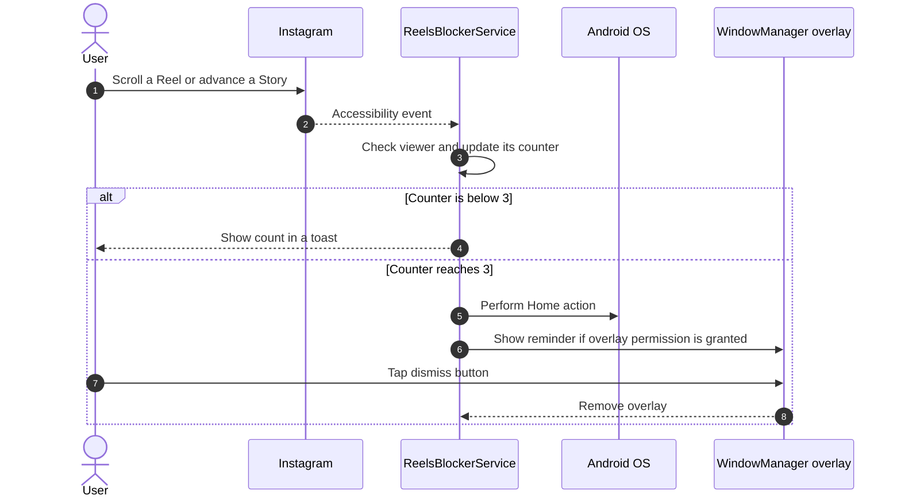

<div align="center">

# Instagram Limiter

**Take back control of your screen time by limiting Instagram Reels and Stories in each session**

[](https://www.android.com/)
[](https://kotlinlang.org/)
[](https://gradle.org/)

</div>

---

## Problem & Motivation

Short-form video feeds are designed for continuous viewing. Instagram Limiter uses Android's Accessibility Service to count Reel scrolling and Story changes, then interrupts the session when the configured threshold is reached.

At the limit, the app returns the device to the Home screen and displays a full-screen reminder. The overlay can be dismissed manually. The app does not force-stop Instagram.

## Key Features

- **Separate session counters:** Reels and Stories are counted independently, with a default threshold of 3 for each.
- **Reel scroll detection:** Counts debounced scroll events while Instagram's Reels viewer is detected.
- **Story transition detection:** Counts changes to the visible Story author.
- **Screen-time interruption:** Returns to the Home screen and shows a reminder overlay at the threshold.
- **No root required:** Uses Android's Accessibility Service and `SYSTEM_ALERT_WINDOW` permission.
- **Event-driven monitoring:** Processes accessibility events and resets counters when an event from another app is received.

## Architecture & How It Works



## Tech Stack

| Category | Technology |
| --- | --- |
| Platform | Native Android, minimum API 26; target API 34 |
| Language | [Kotlin 1.9.22](https://kotlinlang.org/) |
| Build system | [Gradle 8.5](https://gradle.org/) with Android Gradle Plugin 8.2.2 |
| Android APIs | `AccessibilityService`, `WindowManager`, `SYSTEM_ALERT_WINDOW` |
| Java target | Java 17 |

## Getting Started

### Prerequisites & Environment Setup

Before building and deploying the application from source, make sure your development environment and device are properly configured.

#### 1. Java Development Kit (JDK 17)

Gradle and the Android Gradle Plugin (AGP) require OpenJDK 17.

1. Search online for **JDK 17 Windows download**. Download the Windows installer (`.msi` or `.exe`) from an official JDK provider, such as [Oracle](https://www.oracle.com/java/technologies/javase/jdk17-archive-downloads.html).
2. Run the downloaded installer and complete the setup. If offered, enable the options to set `JAVA_HOME` and add Java to `PATH`.
3. Close and reopen your terminal, then verify the installation:

	```powershell
	java -version
	```

The output should report version 17.

#### 2. Android SDK, Command-Line Tools & Platform Tools

If you want to build and install the app without Android Studio, set up the Android SDK manually:

1. Create the folder structure under `%LOCALAPPDATA%\Android\Sdk`, then extract the downloaded command-line tools archive so that its `bin` and `lib` folders are placed directly inside `latest`:

	```text
	%LOCALAPPDATA%\Android\Sdk\
	└── cmdline-tools\
	    └── latest\
	        ├── bin\
	        │   └── sdkmanager.bat
	        └── lib\
	```

2. Download the Android SDK Command-Line Tools for Windows from the official [Android Developer portal](https://developer.android.com/studio#command-tools), then extract the archive into the `latest` folder shown above.

3. Configure `ANDROID_HOME` and add the SDK tools to your user `PATH` in PowerShell:

	```powershell
	[Environment]::SetEnvironmentVariable("ANDROID_HOME", "$env:LOCALAPPDATA\Android\Sdk", "User")

	$currentPath = [Environment]::GetEnvironmentVariable("Path", "User")
	$sdkPaths = "$env:LOCALAPPDATA\Android\Sdk\cmdline-tools\latest\bin;$env:LOCALAPPDATA\Android\Sdk\platform-tools"
	[Environment]::SetEnvironmentVariable("Path", "$currentPath;$sdkPaths", "User")
	```

Close and reopen your terminal so the updated environment variables are loaded.

4. Install the Android SDK packages required to build and debug the app. Run these in PowerShell:

	```powershell
	sdkmanager --licenses
	sdkmanager "platform-tools" "platforms;android-34" "build-tools;34.0.0"
	```

	The first command opens the Android SDK license prompt. Press `y` or accept each license to continue. The second command downloads:
	- `platform-tools` — gives you `adb` and `fastboot`
	- `platforms;android-34` — the Android 14 SDK platform
	- `build-tools;34.0.0` — the Android build tools used by Gradle

	This is the toolchain needed to compile the app and install it on your phone.

#### 3. Device Preparation (USB Debugging & ADB Authorization)

The app targets devices running **Android 8.0 (API 26)** or higher.

1. Enable Developer Options on your device:
	- Open **Settings > About phone > Software information**.
	- Tap **Build number** 7 times until you see the developer confirmation.
2. Enable USB Debugging:
	- Go to **Settings > Developer options**.
	- Toggle **USB debugging** to **On**.
3. Connect and authorize your PC:
	- Connect the phone to your PC with a USB data cable and unlock the screen.
	- When prompted, check **Always allow from this computer** and tap **Allow**.
4. Verify the ADB connection in PowerShell:

	```powershell
	adb devices
	```

	Your device should be listed with the `device` status:

	```text
	List of devices attached
	<DEVICE_SERIAL_ID>    device
	```

### Build

From the repository directory, build a debug APK:

```powershell
.\gradlew.bat assembleDebug
```

The APK is written to `app/build/outputs/apk/debug/app-debug.apk`.

### Install on a connected device

Check that the device is connected and authorized, then install:

```powershell
adb devices
.\gradlew.bat installDebug
```

### Grant permissions

The app needs permission to display over other apps and an enabled Accessibility Service.

To grant overlay permission using ADB:

```powershell
adb shell appops set com.example.instagramlimiter SYSTEM_ALERT_WINDOW allow
```

Alternatively, on the device go to **Settings > Apps > Special app access > Display over other apps > Instagram Limiter** and allow it.

Enable the Accessibility Service from **Settings > Accessibility > Installed apps** (wording varies by device), then select **Instagram Limiter** and turn on its service.

On Android 13/14 and some device builds, Android may block enabling a sideloaded app's accessibility service. If shown, open the app's settings, use the top-right menu to allow restricted settings, then enable the service.

## Configuration

The session threshold and Reel scroll debounce duration are defined near the top of [`ReelsBlockerService.kt`](app/src/main/java/com/example/instagramlimiter/ReelsBlockerService.kt):

```kotlin
private val maxLimit = 3
private val scrollDebounceMs = 1200L
```

The reminder text is passed to `blockAndExitToHome` at the point where the Story or Reel counter reaches its threshold. Rebuild and reinstall after changing the values:

```powershell
.\gradlew.bat installDebug
```

## Notes

- Detection relies on Instagram package names and view IDs; changes to Instagram's interface may affect counting.
- Reel and Story counters are independent, and a threshold is enforced for either content type.
- Counters reset when the service receives an accessibility event from another app.
- This personal productivity project is not affiliated with Instagram or Meta.

## License & Author

- **Author:** [Costin Ghiujan](https://github.com/coxteen))
- **License:** Released under the [MIT License](LICENSE).
